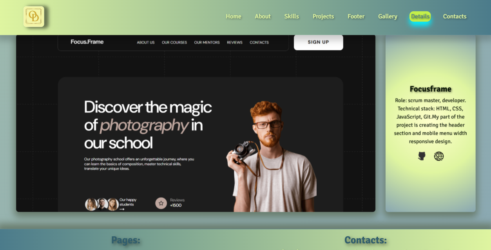

# My Portfolio

_*This website combines projects created independently and in collaboration with
a team. It allows users to conveniently explore the works while staying on a
single page.*_

---

    
    

    
    

## The site contains 3 pages:

- **Home**: _Introduction to the projects and the developer created with js and
  AOS._
- **Gallery**: _Additional photo gallery created with Swiper._
- **Details**: _Information related to education in the IT field, created with
  Grid._

  ***

## This site is created using:

- `Vite`
- `GitHub Pages`
- `Grid`
- `SCSS`
- `JS`
- `Swiper`
- `AOS`

---

- `The first page` provides an introductory character with the projects and the
  developer.
- `The second page`contains an additional photo gallery from the applications
  created with Swiper.
- `The third page` contains information related to education in the IT field and
  is created with Grid.
